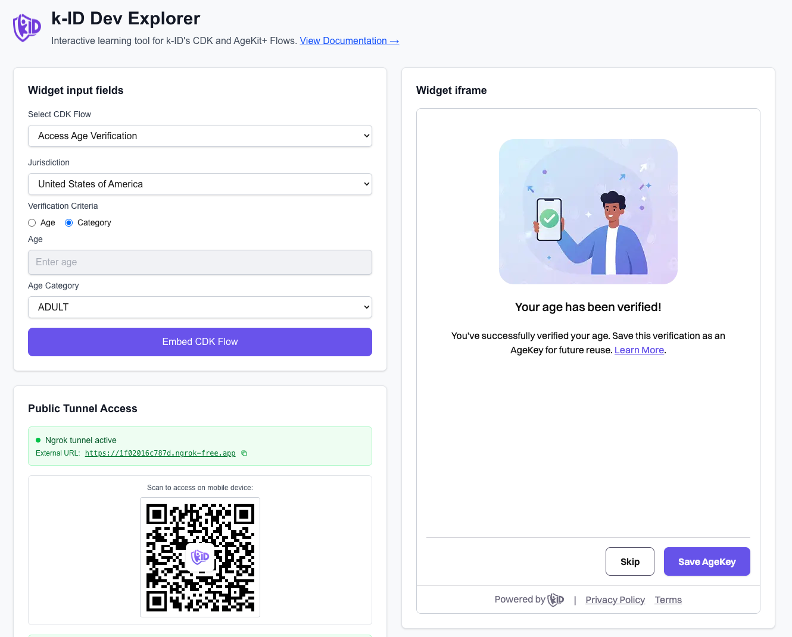

# k-ID Dev Explorer

k-ID コンプライアンス開発キット（CDK）フローを探索・テストするためのインタラクティブな開発者ツールです。Next.jsで構築されており、すべてのCDKフロータイプをテストし、APIトラフィックをリアルタイムで観察し、k-IDの年齢確認およびコンプライアンスフローをアプリケーションに統合する方法を理解するためのビジュアルインターフェースを提供します。



## k-ID CDKとは？

k-IDコンプライアンス開発キットは、年齢確認、保護者の同意、コンプライアンス管理のための事前構築されたフローのセットを提供します。このツールは、開発者がこれらのフローを統合する方法を理解できるよう、以下を提供します：

- **ビジュアルフローテスト**: 実際のAPI呼び出しですべてのCDKフロータイプをテスト
- **リアルタイムAPIトラフィック**: フロー実行時のリクエストとレスポンスを観察
- **トラフィックロギング**: デバッグと分析のためにAPIトラフィックログをダウンロード
- **Webhookレシーバー**: ngrokサポートでWebhook統合をテスト

完全なドキュメントについては、[k-ID Developer Hub](https://docs.k-id.com)をご覧ください。

## 🚀 クイックスタート

### 前提条件

システムにngrokがインストールされていることを確認してください：
- **macOS**: `brew install ngrok`
- **Windows**: [ngrok.com](https://ngrok.com/download)からダウンロード
- **Linux**: [ngrok.com](https://ngrok.com/download)からダウンロード

### インストール

まず、依存関係をインストールします：

```bash
npm install
```

## 環境設定

### k-ID API設定

1. サンプル環境ファイルをコピーします：
   ```bash
   cp .env.example .env.local
   ```

2. [k-ID Compliance Studio](https://portal.k-id.com)からAPIキーを取得します

3. `.env.local`を編集してAPIキーを追加します：
   ```bash
   K_ID_API_KEY=your_actual_api_key_here
   K_ID_API_URL=https://game-api.test.k-id.com
   ```

   `your_actual_api_key_here`をCompliance Studioから取得した実際のAPIキーに置き換えてください。`K_ID_API_URL`はデフォルトでテスト環境に設定されています。準備ができたら、本番環境のURLに変更してください。

k-IDの詳細については、[k-ID Developer Hub](https://docs.k-id.com)を参照してください。

## アプリケーションの実行

### オプション1: ローカル開発のみ
```bash
npm run dev
```
- サーバーは `http://localhost:3100` で実行されます
- Webhook URL: `http://localhost:3100/api/webhook`

### オプション2: ローカル + 外部アクセス（推奨）
```bash
npm run dev:remote
```
- サーバーは `http://localhost:3100` で実行されます
- Ngrokトンネルが外部HTTPS URLを作成します
- Webhook URL: `https://[random].ngrok-free.app/api/webhook`

**注意**: ngrokアカウントと認証トークンがない限り、リモート開発サーバーを再起動するたびにngrok URLが変更されます。

**📱 モバイルアクセス用QRコード**: ngrok（オプション2）で実行する場合、QRコードが自動生成され、「Public Tunnel Access」セクションに表示されます。このQRコードをスマートフォンでスキャンすると、モバイルデバイスでk-ID Dev Explorerにアクセスでき、モバイルデバイスで直接CDKフローをテストできます。

### ⚠️ 重要: WebAuthn要件

ローカルで開発する場合、**HTTPSで実行しない限り、年齢キーの作成と検証は機能しません**。これはWebAuthnの要件です。これはngrokトンネル（オプション2）のもう1つの重要なユースケースです。年齢キーの作成や検証を含むフローをテストする場合は、アプリケーションがHTTPS経由でアクセス可能になるように`npm run dev:remote`を使用する必要があります。

## 使用方法

k-ID Dev Explorerは、k-ID CDKフローをテストするためのインタラクティブな方法を提供します：

1. **フローを選択**: ドロップダウンメニューからCDKフロータイプを選択します（例：Age Gate、Access Age Verification、Age Appealなど）

2. **必要なフィールドを入力**: 選択したフローに必要なフィールドを入力します：
   - **管轄区域**: ほとんどのフローで必要です（例：「US-CA」、「GB」）
   - **年齢基準**: 年齢数値または年齢カテゴリ（一部のフローで必要）
   - **対象者情報**: メール、ID、生年月日、または申告年齢（一部のフローでオプション）
   - **ロケール**: 言語/ロケールコード（例：「en-GB」）- 一部のフローでオプション

3. **「Embed CDK Flow」をクリック**: これによりk-IDへのAPI呼び出しが開始され、返されたURLが画面右側のiframeに埋め込まれます。

4. **トラフィックを観察**: **Events & API Traffic**ウィンドウで以下を確認します：
   - k-IDへのAPIリクエスト
   - URLとIDを含むAPIレスポンス
   - iframeからのPostMessageイベント
   - Webhookイベント（設定されている場合）
   - エラーや警告

5. **フローをステップ実行**: iframe内の埋め込まれたCDKフローを操作します。検証ステップを進めると、イベントウィンドウにイベントが表示されます。

6. **トラフィックログをダウンロード**: Events & API Trafficセクションの**Download**ボタンをクリックして、すべてのAPIトラフィックのコピーをテキストファイルとして保存し、分析やデバッグに使用します。

### 利用可能なCDKフロー

- **Access Age Verification**: アクセス許可前にユーザーの年齢を確認
- **Age Gate**: ユーザーに年齢確認オプションを提示
- **Facial Age Estimation**: 顔認識を使用して年齢を推定
- **ID Verification**: 政府発行の身分証明書で身元を確認
- **Trusted Adult Verification**: 信頼できる成人の確認を通じて確認
- **Age Appeal**: ユーザーが年齢確認決定に異議を申し立てることを許可
- **VPC End-to-End**: 完全な検証、同意、および許可フロー
- **Direct Notices**: コンプライアンス通知を直接表示
- **Manage Session Permissions**: 既存セッションの権限を管理

各フローの詳細なドキュメントについては、[k-ID Developer Hub](https://docs.k-id.com)をご覧ください。

## 🌐 Webhookレシーバー

アプリケーションには、ngrokトンネル経由でローカルおよび外部からアクセスできるWebhookレシーバーが含まれています。

### Webhook URL

アプリケーションは、ngrokが実行されているときに外部URLを自動的に検出して表示します：

- **🌐 外部URL**: `https://[random].ngrok-free.app/api/webhook`（ngrokがアクティブな場合）
- **🏠 ローカルURL**: `http://localhost:3100/api/webhook`（ngrokが実行されていない場合のフォールバック）

**Webhook URLの設定**: k-IDからWebhookイベントを受信するには、[k-ID Compliance Studio](https://portal.k-id.com)でWebhook URLを設定する必要があります。製品設定に移動し、WebhookレシーバーURLを上記の外部URL（ngrokを使用する場合）またはデプロイされたアプリケーションURLに設定します。Webhook URLは、k-IDがアプリケーションにイベントを送信できるように、公開アクセス可能である必要があります。

## 📊 リアルタイムモニタリング

- **イベントウィンドウ**: すべてのWebhookイベントがメインインターフェースにリアルタイムで表示されます
- **Server-Sent Events**: Webhookを受信したときに自動更新
- **イベント詳細**: ヘッダー、本文、メソッド、タイムスタンプを含む完全なリクエスト情報
- **コピー機能**: コピーボタンをクリックしてWebhookデータをクリップボードにコピー

## 🛠️ 開発

### 環境変数

`.env.example`を`.env.local`にコピーして設定します：

- `K_ID_API_KEY` - k-ID APIキー（CDKフローに必要）
  - [k-ID Compliance Studio](https://portal.k-id.com)からAPIキーを取得
- `K_ID_API_URL` - k-ID APIベースURL（デフォルト: https://game-api.test.k-id.com）
  - テスト環境: `https://game-api.test.k-id.com`
  - 本番環境: `https://game-api.k-id.com`
- `PORT` - サーバーポート（デフォルト: 3100、オプション）
- `NEXT_PUBLIC_APP_URL` - ローカルURLをオーバーライド（オプション）

### スクリプト

- `npm run dev` - 開発サーバーのみを起動
- `npm run dev:remote` - ngrokトンネル付きで開発サーバーを起動
- `npm run dev:ngrok` - ngrokトンネルのみを起動
- `npm run build` - 本番用にビルド
- `npm run start` - 本番サーバーを起動
- `npm run lint` - ESLintを実行

## 📝 注意事項

- NgrokはセキュリティのためにデフォルトでHTTPSトンネルを作成します
- アプリケーションはHTTPとHTTPSの両方のトンネルを自動的に検出します
- Webhookイベントはメモリに保存されます（最後の100イベント）
- SSE接続には接続を維持するためのハートビートが含まれています
- Ngrokトンネル情報は10秒ごとに更新されます
- イベントウィンドウには意味のあるイベントのみが表示されます（APIトラフィック、Webhookペイロード、JSイベント）

## ドキュメントとリソース

- **[k-ID Developer Hub](https://docs.k-id.com)** - k-IDの完全なドキュメントと統合ガイド
- **[k-ID Compliance Studio](https://portal.k-id.com)** - APIキーを取得し、k-ID統合を管理
- **[k-ID CDK Documentation](https://docs.k-id.com/docs/cdk/intro)** - CDKの概要と開始方法
- **[Next.js Documentation](https://nextjs.org/docs)** - Next.jsフレームワークのドキュメント
- **[Ngrok Documentation](https://ngrok.com/docs)** - Ngrokトンネリングのドキュメント


