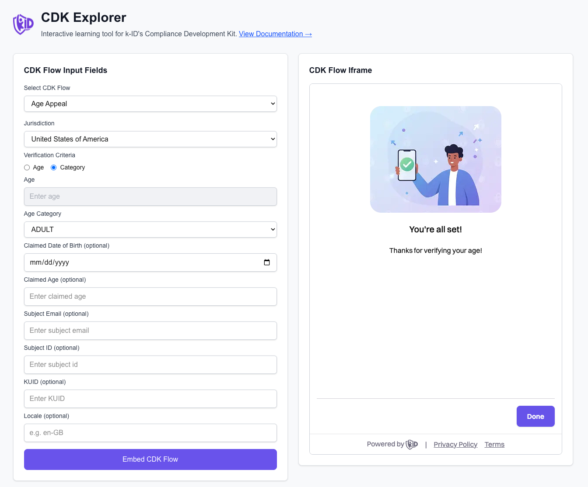

# k-ID Dev Explorer

用于探索和测试 k-ID 合规开发工具包 (CDK) 流程的交互式开发者工具。使用 Next.js 构建，该工具提供了一个可视化界面，用于测试所有 CDK 流程类型、实时观察 API 流量，并了解如何将 k-ID 的年龄验证和合规流程集成到您的应用程序中。



## 什么是 k-ID CDK？

k-ID 合规开发工具包提供了一组用于年龄验证、家长同意和合规管理的预构建流程。该工具通过提供以下内容帮助开发者了解如何集成这些流程：

- **可视化流程测试**：使用实际 API 调用测试所有 CDK 流程类型
- **实时 API 流量**：观察流程执行时的请求和响应
- **流量日志记录**：下载 API 流量日志用于调试和分析
- **Webhook 接收器**：使用 ngrok 支持测试 Webhook 集成

完整文档请访问 [k-ID Developer Hub](https://docs.k-id.com)。

## 🚀 快速开始

### 先决条件

确保您的系统已安装 ngrok：
- **macOS**: `brew install ngrok`
- **Windows**: 从 [ngrok.com](https://ngrok.com/download) 下载
- **Linux**: 从 [ngrok.com](https://ngrok.com/download) 下载

### 安装

首先，安装依赖项：

```bash
npm install
```

## 环境设置

### k-ID API 配置

1. 复制示例环境文件：
   ```bash
   cp .env.example .env.local
   ```

2. 从 [k-ID Compliance Studio](https://portal.k-id.com) 获取您的 API 密钥

3. 编辑 `.env.local` 并添加您的 API 密钥：
   ```bash
   K_ID_API_KEY=your_actual_api_key_here
   K_ID_API_URL=https://game-api.test.k-id.com
   ```

   将 `your_actual_api_key_here` 替换为从 Compliance Studio 获取的实际 API 密钥。`K_ID_API_URL` 默认设置为测试环境。准备就绪后，将其更改为生产环境 URL。

有关 k-ID 入门的更多信息，请参阅 [k-ID Developer Hub](https://docs.k-id.com)。

## 运行应用程序

### 选项 1：仅本地开发
```bash
npm run dev
```
- 服务器在 `http://localhost:3100` 上运行
- Webhook URL: `http://localhost:3100/api/webhook`

### 选项 2：本地 + 外部访问（推荐）
```bash
npm run dev:remote
```
- 服务器在 `http://localhost:3100` 上运行
- Ngrok 隧道创建外部 HTTPS URL
- Webhook URL: `https://[random].ngrok-free.app/api/webhook`

**注意**：除非您有 ngrok 账户和认证令牌，否则每次重启远程开发服务器时，ngrok URL 都会更改。

**📱 移动访问的 QR 码**：使用 ngrok（选项 2）运行时，QR 码会自动生成并显示在"Public Tunnel Access"部分。用手机扫描此 QR 码可以访问移动设备上的 k-ID Dev Explorer，从而直接在移动设备上测试 CDK 流程。

### ⚠️ 重要：WebAuthn 要求

在本地开发时，**除非通过 HTTPS 运行，否则年龄密钥创建和验证将无法工作**，这是 WebAuthn 的要求。这是 ngrok 隧道（选项 2）的另一个重要用例。如果您正在测试涉及年龄密钥创建或验证的流程，必须使用 `npm run dev:remote` 以确保应用程序可通过 HTTPS 访问。

## 使用方法

k-ID Dev Explorer 提供了一种交互式方法来测试 k-ID CDK 流程：

1. **选择流程**：从下拉菜单中选择 CDK 流程类型（例如：Age Gate、Access Age Verification、Age Appeal 等）

2. **输入必填字段**：为所选流程填写必要的字段：
   - **管辖区**：大多数流程需要（例如："US-CA"、"GB"）
   - **年龄标准**：年龄数字或年龄类别（某些流程需要）
   - **主体信息**：电子邮件、ID、出生日期或声明的年龄（某些流程为可选）
   - **区域设置**：语言/区域设置代码（例如："en-GB"）- 某些流程为可选

3. **点击"Embed CDK Flow"**：这将启动对 k-ID 的 API 调用，并将返回的 URL 嵌入到屏幕右侧的 iframe 中。

4. **观察流量**：查看 **Events & API Traffic** 窗口以查看：
   - 对 k-ID 发出的 API 请求
   - 包含 URL 和 ID 的 API 响应
   - 来自 iframe 的 PostMessage 事件
   - Webhook 事件（如果已配置）
   - 任何错误或警告

5. **逐步执行流程**：与 iframe 中嵌入的 CDK 流程进行交互。当您逐步完成验证步骤时，观察事件窗口中出现的事件。

6. **下载流量日志**：点击 Events & API Traffic 部分中的 **Download** 按钮，将所有 API 流量的副本保存为文本文件，用于分析或调试。

### 可用的 CDK 流程

- **Access Age Verification**：在授予访问权限之前验证用户的年龄
- **Age Gate**：向用户展示年龄验证选项
- **Facial Age Estimation**：使用面部识别估计年龄
- **ID Verification**：使用政府颁发的身份证件验证身份
- **Trusted Adult Verification**：通过受信任的成人确认进行验证
- **Age Appeal**：允许用户对年龄验证决定提出申诉
- **VPC End-to-End**：完整的验证、同意和权限流程
- **Direct Notices**：直接显示合规通知
- **Manage Session Permissions**：管理现有会话的权限

每个流程的详细文档，请访问 [k-ID Developer Hub](https://docs.k-id.com)。

## 🌐 Webhook 接收器

应用程序包含一个可通过 ngrok 隧道在本地和外部访问的 Webhook 接收器。

### Webhook URL

应用程序在 ngrok 运行时自动检测并显示外部 URL：

- **🌐 外部 URL**: `https://[random].ngrok-free.app/api/webhook`（当 ngrok 处于活动状态时）
- **🏠 本地 URL**: `http://localhost:3100/api/webhook`（当 ngrok 未运行时的回退）

**配置您的 Webhook URL**：要从 k-ID 接收 Webhook 事件，您需要在 [k-ID Compliance Studio](https://portal.k-id.com) 中配置 Webhook URL。导航到您的产品设置，将 Webhook 接收器 URL 设置为上面显示的外部 URL（使用 ngrok 时）或您部署的应用程序 URL。Webhook URL 必须是公开可访问的，以便 k-ID 可以向您的应用程序发送事件。

## 📊 实时监控

- **事件窗口**：所有 Webhook 事件都会在主界面中实时显示
- **Server-Sent Events**：接收 Webhook 时自动更新
- **事件详细信息**：包括标头、正文、方法和时间戳的完整请求信息
- **复制功能**：点击复制按钮将 Webhook 数据复制到剪贴板

## 🛠️ 开发

### 环境变量

将 `.env.example` 复制到 `.env.local` 并配置：

- `K_ID_API_KEY` - 您的 k-ID API 密钥（CDK 流程需要）
  - 从 [k-ID Compliance Studio](https://portal.k-id.com) 获取 API 密钥
- `K_ID_API_URL` - k-ID API 基础 URL（默认值：https://game-api.test.k-id.com）
  - 测试环境：`https://game-api.test.k-id.com`
  - 生产环境：`https://game-api.k-id.com`
- `PORT` - 服务器端口（默认值：3100，可选）
- `NEXT_PUBLIC_APP_URL` - 覆盖本地 URL（可选）

### 脚本

- `npm run dev` - 仅启动开发服务器
- `npm run dev:remote` - 使用 ngrok 隧道启动开发服务器
- `npm run dev:ngrok` - 仅启动 ngrok 隧道
- `npm run build` - 构建生产版本
- `npm run start` - 启动生产服务器
- `npm run lint` - 运行 ESLint

## 📝 注意事项

- Ngrok 默认创建 HTTPS 隧道以确保安全
- 应用程序自动检测 HTTP 和 HTTPS 隧道
- Webhook 事件存储在内存中（最近 100 个事件）
- SSE 连接包括心跳以保持连接活动
- Ngrok 隧道信息每 10 秒刷新一次
- 事件窗口仅显示有意义的事件（API 流量、Webhook 负载、JS 事件）

## 文档和资源

- **[k-ID Developer Hub](https://docs.k-id.com)** - k-ID 的完整文档和集成指南
- **[k-ID Compliance Studio](https://portal.k-id.com)** - 获取 API 密钥并管理您的 k-ID 集成
- **[k-ID CDK Documentation](https://docs.k-id.com/docs/cdk/intro)** - CDK 概述和入门
- **[Next.js Documentation](https://nextjs.org/docs)** - Next.js 框架文档
- **[Ngrok Documentation](https://ngrok.com/docs)** - Ngrok 隧道文档


